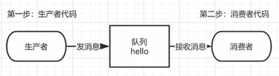
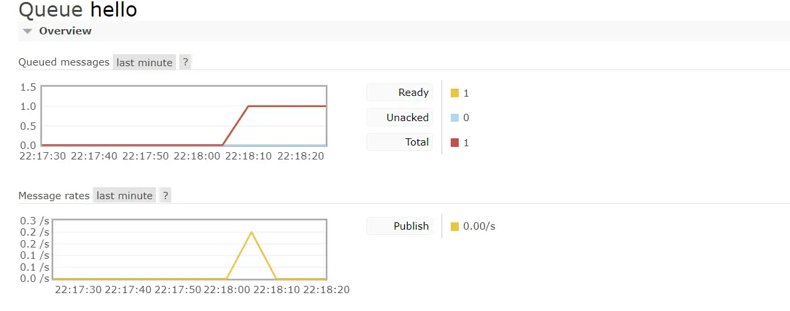

# 简单队列模式

# 一、流程

​		用 Java 编写两个程序。发送单个消息的生产者和接收消息并打印出来的消费者

​		在下图中，“ P” 是我们的生产者，“ C” 是我们的消费者。中间的框是一个队列 RabbitMQ 代表使用者保留的消息缓冲区

​	

> 注意
>
> Java 进行连接的时候，需要 Linux 开放 5672 端口，否则会连接超时
>
> 访问 Web 界面的端口是 15672，连接服务器的端口是 5672



# 二、消息生产者

​		创建一个类作为生产者，最终生产消息到 RabbitMQ 的队列里。

```
1. 创建 RabbitMQ 连接工厂
2. 进行 RabbitMQ 工厂配置信息
3. 创建 RabbitMQ 连接
4. 创建 RabbitMQ 信道
5. 生成一个队列
6. 发送一个消息到交换机，交换机发送到队列。"" 代表默认交换机
```



```java
public class Producer {
    //队列名称
    public static final String QUEUE_NAME = "hello";

    //发消息
    public static void main(String[] args) throws IOException, TimeoutException {
        //获得信道
		Channel channel = RabbitMqUtils.getChannel();
        /**
         * 生成一个队列
         *  1.队列名
         *  2.消息是否持久化,默认情况下消息存储在内存中
         *  3.该队列是否只供一个消费之消费 是否进行消息共享 true 可以多个消费者消费 ,false 只能一个消费者消费
         *  4.是否自动删除 最后一个消费者端开连接后 该队列是否自动删除
         *  5.其他参数...null  死信队列...
         */
        channel.queueDeclare(QUEUE_NAME, false, false, false, null);
        //发消息
        String message = "hello world";
        /**
         *  1.发送到哪个交换机
         *  2.路由的key值是哪个
         *  3.其他参数信息
         *  4.发送的消息
         */
        channel.basicPublish("", QUEUE_NAME, null, message.getBytes(StandardCharsets.UTF_8));
        System.out.println("消息发送完毕");
    }
}
```

# 三、消息消费者

```java
public class Consumer {
    //队列的名称
    public static final String QUEUE_NAME = "hello";

    //接收消息
    public static void main(String[] args) throws IOException, TimeoutException {
        //获得信道
		Channel channel = RabbitMqUtils.getChannel();
        //声明接收消息
        DeliverCallback deliverCallback = (consumerTag, message) -> {
            System.out.println(new String(message.getBody()));
        };
        //取消消息时的回调
        CancelCallback cancelCallback = (consumerTag) -> {
            System.out.println("消息消费被中断");
        };
        /**
         * 消费者消费消息
         *  1.消费哪个队列
         *  2.消费成功之后是否自动应答
         *  3.消费者成功消费的回调
         *  4.消费者取消消费的回调
         */
        channel.basicConsume(QUEUE_NAME, true, deliverCallback, cancelCallback);
    }
}
```

