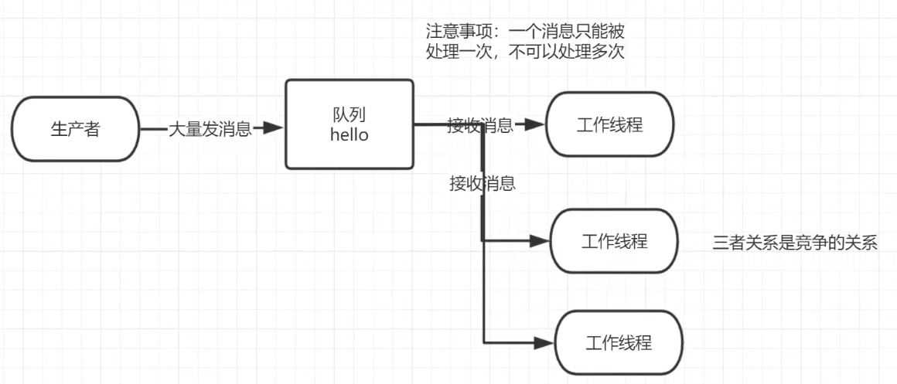
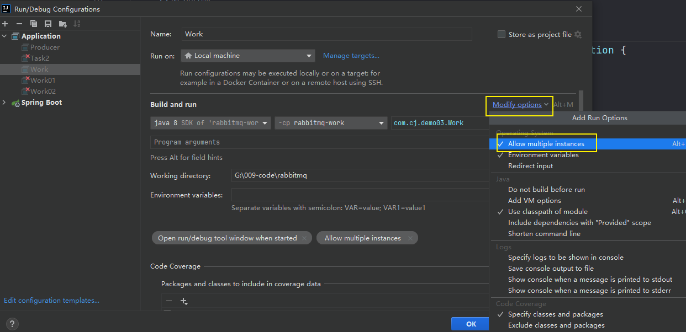
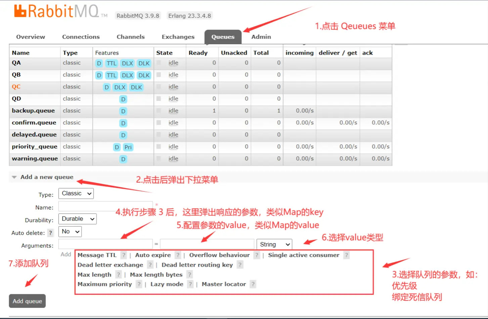

# 工作队列模式

> Work Queues 是工作队列（又称任务队列）的主要思想是避免立即执行资源密集型任务，而不得不等待它完成。相反我们安排任务在之后执行。我们把任务封装为消息并将其发送到队列。在后台运行的工作进程将弹出任务并最终执行作业。当有多个工作线程时，这些工作线程将一起处理这些任务。

# 一、轮询消费

​		轮询消费消息指的是轮流消费消息，即每个工作队列都会获取一个消息进行消费，并且获取的次数按照顺序依次往下轮流。

​		案例中生产者叫做 Task，一个消费者就是一个工作队列，启动两个工作队列消费消息，这个两个工作队列会以轮询的方式消费消息。



# 二、消息生产者

```java
public class Producer {
    public static final String TASK_QUEUE_NAME = "ack_queue";
    public static void main(String[] args) throws Exception {
        Channel channel = RabbitMqUtils.getChannel();
        //消息持久化
        boolean durable = true;
        //声明队列
        channel.queueDeclare(TASK_QUEUE_NAME, durable, false, false, null);
        //从控制台输入信息
        Scanner scanner = new Scanner(System.in);
        while (scanner.hasNext()) {
            String message = scanner.next();
            //消息持久化:MessageProperties.PERSISTENT_TEXT_PLAIN
            channel.basicPublish("", TASK_QUEUE_NAME, MessageProperties.PERSISTENT_TEXT_PLAIN, message.getBytes(StandardCharsets.UTF_8));
            System.out.println("生产者发出消息" + message);
        }
    }
}
```

# 三、消息消费者

## 1、工作线程一

```java
public class Consumer01 {
    public static final String TASK_QUEUE_NAME = "ack_queue";

    public static void main(String[] args) throws IOException, TimeoutException {
        Channel channel = RabbitMqUtils.getChannel();
        //接收消息
        System.out.println("C1等待接收消息处理");

        //0,默认轮询分发,1不公平分发,能者多劳
        int prefetchCount = 0;
        channel.basicQos(prefetchCount);

        //采用手动应答
        boolean autoAck = false;
        channel.basicConsume(TASK_QUEUE_NAME, autoAck, (consumerTag, message) -> {
                    //线程沉睡
                    SleepUtils.sleep(1);
                    System.out.println("接收到的消息:" + new String(message.getBody(), StandardCharsets.UTF_8));
                    //手动应答 1.消息的标记 2.是否批量应答
                    channel.basicAck(message.getEnvelope().getDeliveryTag(), false);
                }, (consumerTag) -> {
                    System.out.println(consumerTag + "消息消费被中断");
                }
        );
    }
}
```

## 2、工作线程二

```java
public class Consumer02 {
    public static final String TASK_QUEUE_NAME = "ack_queue";

    public static void main(String[] args) throws IOException, TimeoutException {
        Channel channel = RabbitMqUtils.getChannel();
        //接收消息
        System.out.println("C2等待接收消息处理");

        //0,默认轮询分发,1不公平分发,能者多劳
        int prefetchCount = 0;
        channel.basicQos(prefetchCount);

        //采用手动应答
        boolean autoAck = false;
        channel.basicConsume(TASK_QUEUE_NAME, autoAck, (consumerTag, message) -> {
                    //线程沉睡
                    SleepUtils.sleep(30);
                    System.out.println("接收到的消息:" + new String(message.getBody(), StandardCharsets.UTF_8));
                    //手动应答 1.消息的标记 2.是否批量应答
                    channel.basicAck(message.getEnvelope().getDeliveryTag(), false);
                }, (consumerTag) -> {
                    System.out.println(consumerTag + "消息消费被中断");
                }
        );
    }
}
```

## 3、多线程开启的方式



# 四、web页面添加队列

进入自己的 RabbitMQ Web 页面，点击 Queues 菜单



1. 点击 `Queues` 菜单
2. 点击 `Add a new queue`，弹出下拉菜单
3. 下方的很多参数可以进行选择（旁边有 ？的参数），如优先级（`Lazy mode`）、绑定死信队列（`Dead letter exchange/routing key`）
4. 执行步骤 3 后，在 `Arguments` 的第一个文本框弹出对应的参数，类似于 Map 的 key
5. 第二个文本框填写参数，类似于 Map 的 value
6. 第三个是下拉菜单，选择 value 类型
7. 点击 `Add queue`，添加队列

# 