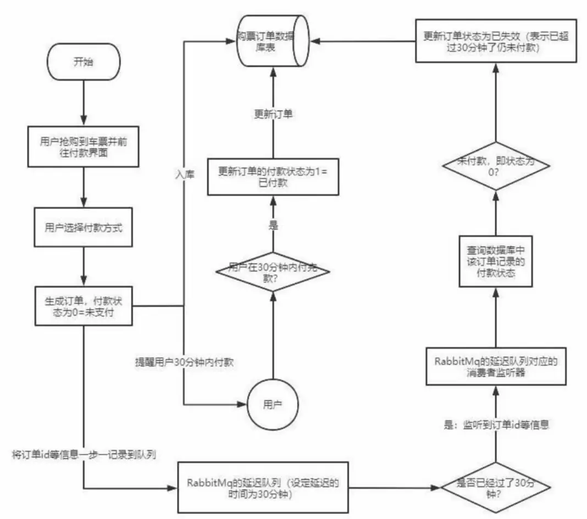

# RabbitMQ延迟队列

# 一、延迟队列介绍

## 1、延迟队列概念

​		延时队列：队列内部是有序的，最重要的特性就体现在它的延时属性上，延时队列中的元素是希望在指定时间到了以后或之前取出和处理，简单来说，延时队列就是用来存放需要在指定时间被处理的元素的队列。

## 2、延迟队列使用场景

- 订单在十分钟之内未支付则自动取消
- 新创建的店铺，如果在十天内都没有上传过商品，则自动发送消息提醒
- 用户注册成功后，如果三天内没有登陆则进行短信提醒
- 用户发起退款，如果三天内没有得到处理则通知相关运营人员
- 预定会议后，需要在预定的时间点前十分钟通知各个与会人员参加会议

​		这些场景都有一个特点，**需要在某个事件发生之后或者之前的指定时间点完成某一项任务**，如： 发生订单生成事件，在十分钟之后检查该订单支付状态，然后将未支付的订单进行关闭；那我们一直轮询数据，每秒查一次，取出需要被处理的数据，然后处理不就完事了吗？

​		如果数据量比较少，确实可以这样做，比如：对于「如果账单一周内未支付则进行自动结算」这样的需求， 如果对于时间不是严格限制，而是宽松意义上的一周，那么每天晚上跑个定时任务检查一下所有未支付的账单，确实也是一个可行的方案。但对于数据量比较大，并且时效性较强的场景，如：「订单十分钟内未支付则关闭」，短期内未支付的订单数据可能会有很多，活动期间甚至会达到百万甚至千万级别，对这么庞大的数据量仍旧使用轮询的方式显然是不可取的，很可能在一秒内无法完成所有订单的检查，同时会给数据库带来很大压力，无法满足业务要求而且性能低下。

# 二、TTL的两种设置

​		TTL 是什么呢？TTL 是 RabbitMQ 中一个消息或者队列的属性，表明一条消息或者该队列中的所有消息的最大存活时间，单位是毫秒。

​		换句话说，如果一条消息设置了 TTL 属性或者进入了设置 TTL 属性的队列，那么这条消息如果在 TTL 设置的时间内没有被消费，则会成为「死信」。如果同时配置了队列的 TTL 和消息的 TTL，那么较小的那个值将会被使用，有两种方式设置 TTL。

**队列设置 TTL**

在创建队列的时候设置队列的 x-message-ttl 属性

# 三、整合SpringBoot

# 四、队列TTL

# 五、RabbitMQ插件实现延迟队列

# 六、插件总结