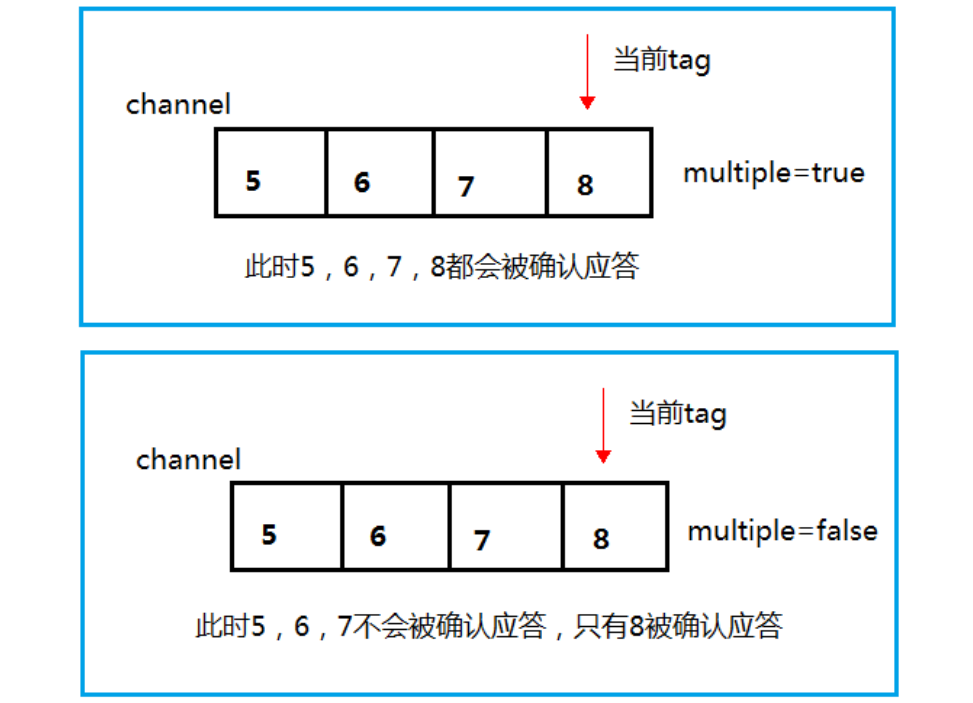
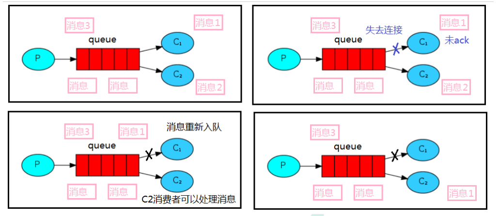
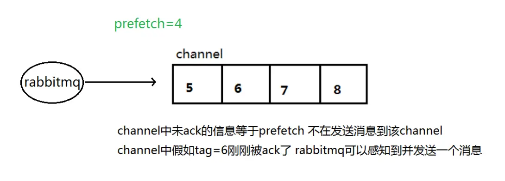

# 五、RabbitMQ消息应答

## 1、消息应答

​		消费者完成一个任务可能需要一段时间，如果其中一个消费者处理一个长的任务并仅只完成了部分突然它挂掉了，会发生什么情况。RabbitMQ 一旦向消费者传递了一条消息，便立即将该消息标记为删除。在这种情况下，突然有个消费者挂掉了，我们将丢失正在处理的消息。以及后续发送给该消费者的消息，因为它无法接收到。

​		为了保证消息在发送过程中不丢失，引入消息应答机制，消息应答就是：消费者在接收到消息并且处理该消息之后，告诉 rabbitmq 它已经处理了，rabbitmq 可以把该消息删除了。

### 自动应答

​		消息发送后立即被认为已经传送成功，这种模式需要在**高吞吐量和数据传输安全性方面做权衡**,因为这种模式如果消息在接收到之前，消费者那边出现连接或者 channel 关闭，那么消息就丢失了,当然另一方面这种模式消费者那边可以传递过载的消息，**没有对传递的消息数量进行限制**，当然这样有可能使得消费者这边由于接收太多还来不及处理的消息，导致这些消息的积压，最终使得内存耗尽，最终这些消费者线程被操作系统杀死，**所以这种模式仅适用在消费者可以高效并以某种速率能够处理这些消息的情况下使用。**

### 手动应答

```java
//采用手动应答
boolean autoAck = false;
channel.basicConsume(TASK_QUEUE_NAME, autoAck, (consumerTag, message) -> {
    System.out.println("接收到的消息:" + new String(message.getBody(), StandardCharsets.UTF_8));
    //手动应答 1.消息的标记 2.是否批量应答
    channel.basicAck(message.getEnvelope().getDeliveryTag(), false);
}, (consumerTag) -> {
    System.out.println(consumerTag + "消息消费被中断");
});
```

- Channel.basicAck(用于肯定确认)：RabbitMQ 已经知道该消息并且成功的处理消息，可以将其丢弃了
- Channel.basicNack(用于否定确认) 
- Channel.basicReject(用于否定确认) ：可以批量应答，可能造成消息丢失的可能

**Multiple 的解释：**

手动应答的好处是可以批量应答并且减少网络拥堵

- true 代表批量应答 channel 上未应答的消息，比如说 channel 上有传送 tag 的消息 5,6,7,8 当前 tag 是 8 那么此时 5-8 的这些还未应答的消息都会被确认收到消息应答
- false 同上面相比只会应答 tag=8 的消息 5,6,7 这三个消息依然不会被确认收到消息应答



## 2、消息重新入队

​		保证消息不丢失的机制

​		如果消费者由于某些原因失去连接(其通道已关闭，连接已关闭或 TCP 连接丢失)，导致消息未发送 ACK 确认，RabbitMQ 将了解到消息未完全处理，并将对其重新排队。如果此时其他消费者可以处理，它将很快将其重新分发给另一个消费者。这样，即使某个消费者偶尔死亡，也可以确保不会丢失任何消息。



## 3、持久化

​		当 RabbitMQ 服务停掉以后，消息生产者发送过来的消息不丢失要如何保障？默认情况下 RabbitMQ 退出或由于某种原因崩溃时，它忽视队列和消息，除非告知它不要这样做。确保消息不会丢失需要做两件事：**我们需要将队列和消息都标记为持久化。**

###  队列持久化

​		之前我们创建的队列都是非持久化的，RabbitMQ 如果重启的化，该队列就会被删除掉，如果要队列实现持久化需要在声明队列的时候把 durable 参数设置为true，代表开启持久化

```java
//生产者队列持久化
boolean durable = true;
//生产者声明队列
channel.queueDeclare(TASK_QUEUE_NAME, durable, false, false, null);
```

> 注意：
>
> 如果之前声明的队列不是持久化的，需要把原先队列先删除，或者重新创建一个持久化的队列

不然就会出现如下错误：


### 消息持久化

​		将消息标记为持久化并不能完全保证不会丢失消息。尽管它告诉 RabbitMQ 将消息保存到磁盘，但是这里依然存在当消息刚准备存储在磁盘的时候 但是还没有存储完，消息还在缓存的一个间隔点。此时并没有真正写入磁盘。持久性保证并不强，但是对于我们的简单任务队列而言，这已经绰绰有余了。

```java
//生产者发布消息:消息持久化:MessageProperties.PERSISTENT_TEXT_PLAIN
channel.basicPublish("", "", MessageProperties.PERSISTENT_TEXT_PLAIN,""))
```

## 4、不公平分发

​		在最开始的时候我们学习到 RabbitMQ 分发消息采用的轮询分发，但是在某种场景下这种策略并不是很好，比方说有两个消费者在处理任务，其中有个**消费者 1** 处理任务的速度非常快，而另外一个**消费者 2** 处理速度却很慢，这个时候我们还是采用轮询分发的化就会到这处理速度快的这个消费者很大一部分时间处于空闲状态，而处理慢的那个消费者一直在干活，这种分配方式在这种情况下其实就不太好，但是 RabbitMQ 并不知道这种情况它依然很公平的进行分发。

- 0表示轮询分发
- 1表示不公平分发
- 充分利用服务器资源

```java
int prefetchCount = 1;
channel.basicQos(prefetchCount);
```

​		不公平分发思想：如果一个工作队列还没有处理完或者没有应答签收一个消息，则不拒绝 RabbitMQ 分配新的消息到该工作队列。此时 RabbitMQ 会优先分配给其他已经处理完消息或者空闲的工作队列。如果所有的消费者都没有完成手上任务，队列还在不停的添加新任务，队列有可能就会遇到队列被撑满的情况，这个时候就只能添加新的 worker (工作队列)或者改变其他存储任务的策略。

## 5、预取值(权重)

​		默认消息的发送是异步发送的，所以在任何时候，channel 上不止只有一个消息来自消费者的手动确认，所以本质上是异步的。因此这里就存在一个未确认的消息缓冲区，因此希望开发人员能**限制此缓冲区的大小**，**以避免缓冲区里面无限制的未确认消息问题**。这个时候就可以通过使用 `basic.qos` 方法设置「预取计数」值来完成的。

​		该值定义通道上允许的未确认消息的最大数量。一旦数量达到配置的数量， RabbitMQ 将停止在通道上传递更多消息，除非至少有一个未处理的消息被确认，**例如，假设在通道上有未确认的消息 5、6、7，8，并且通道的预取计数设置为 4，此时 RabbitMQ 将不会在该通道上再传递任何消息，除非至少有一个未应答的消息被 ack。比方说 tag=6 这个消息刚刚被确认 ACK，RabbitMQ 将会感知这个情况到并再发送一条消息。消息应答和 QoS 预取值对用户吞吐量有重大影响。**

​		通常，增加预取将提高向消费者传递消息的速度。**虽然自动应答传输消息速率是最佳的，但是，在这种情况下已传递但尚未处理的消息的数量也会增加，从而增加了消费者的 RAM 消耗**(随机存取存储器)应该小心使用具有无限预处理的自动确认模式或手动确认模式，消费者消费了大量的消息如果没有确认的话，会导致消费者连接节点的内存消耗变大，所以找到合适的预取值是一个反复试验的过程，不同的负载该值取值也不同 100 到 300 范围内的值通常可提供最佳的吞吐量，并且不会给消费者带来太大的风险。

​		预取值为 1 是最保守的。当然这将使吞吐量变得很低，特别是消费者连接延迟很严重的情况下，特别是在消费者连接等待时间较长的环境中。对于大多数应用来说，稍微高一点的值将是最佳的。



```java
int prefetchCount = 2;
channel.basicQos(prefetchCount);
```

>注意：
>
>不公平分发和预取值分发都用到 `basic.qos` 方法，如果取值为 1，代表不公平分发，取值不为1，代表预取值分发，取值为0，代表轮询分发

# 