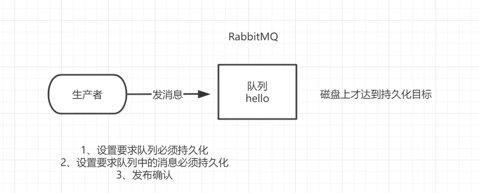
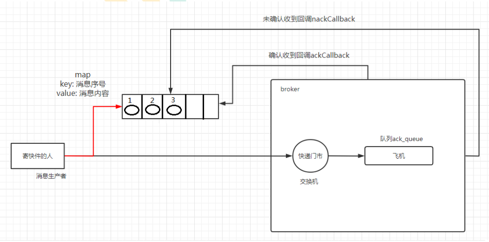

# 六、发布确认模式

> ​		生产者发布消息到 RabbitMQ 后，需要 RabbitMQ 返回「ACK（已收到）」给生产者，这样生产者才知道自己生产的消息成功发布出去。
>
> ​		发布确认指的是当生产者将消息发送到队列上，队列将消息持久化，然后发送一个确认给生产者



## 1、 发布确认逻辑

​		生产者将信道设置成 confirm 模式，一旦信道进入 confirm 模式，所有在该信道上面发布的消息都将会被指派一个唯一的 ID(从 1 开始)，一旦消息被投递到所有匹配的队列之后，broker 就会发送一个确认给生产者(包含消息的唯一 ID)，这就使得生产者知道消息已经正确到达目的队列了，如果消息和队列是可持久化的，那么确认消息会在将消息写入磁盘之后发出，broker 回传给生产者的确认消息中 delivery-tag 域包含了确认消息的序列号，此外 broker 也可以设置 basic.ack 的 multiple 域，表示到这个序列号之前的所有消息都已经得到了处理。

​		confirm 模式最大的好处在于是异步的，一旦发布一条消息，生产者应用程序就可以在等信道返回确认的同时继续发送下一条消息，当消息最终得到确认之后，生产者应用便可以通过回调方法来处理该确认消息，如果RabbitMQ 因为自身内部错误导致消息丢失，就会发送一条 nack 消息， 生产者应用程序同样可以在回调方法中处理该 nack 消息。

## 2 、开启发布确认

```java
//开启发布确认的方法
//确认发布指的是成功发送到了队列，并不是消费者消费了消息。
channel.confirmSelect();
```

## 2、单个发布确认

​		这是一种简单的确认方式，它是一种**同步确认发布**的方式，也就是发布一个消息之后只有它被确认发布，后续的消息才能继续发布，`waitForConfirmsOrDie(long)` 这个方法只有在消息被确认的时候才返回，如果在指定时间范围内这个消息没有被确认那么它将抛出异常。

​		这种确认方式有一个最大的缺点就是：**发布速度特别的慢**，因为如果没有确认发布的消息就会阻塞所有后续消息的发布，这种方式最多提供每秒不超过数百条发布消息的吞吐量。当然对于某些应用程序来说这可能已经足够了。

```java
public class ProducerConfirmMessage {

    //批量发消息的格式
    public static final int MESSAGE_COUNT = 1000;

    public static void main(String[] args) throws Exception {
        publishMessage();
    }

    private static void publishMessage() throws Exception {
        Channel channel = RabbitMqUtils.getChannel();
        String queueName = UUID.randomUUID().toString();
        //队列声明
        channel.queueDeclare(queueName, true, false, false, null);
        //开启发布确认模式
        channel.confirmSelect();
        //开始时间
        long begin = System.currentTimeMillis();
        //批量发消息
        for (int i = 0; i < MESSAGE_COUNT; i++) {
            String message = i + "";
            channel.basicPublish("", queueName, null, message.getBytes(StandardCharsets.UTF_8));
            //单个消息马上确认发布
            boolean flag = channel.waitForConfirms();
            if (flag) System.out.println("消息发送成功");
        }
        //结束时间
        long end = System.currentTimeMillis();
        System.out.println("发布" + MESSAGE_COUNT + "条单独确认数据" + "耗时" + (end - begin) + "ms");
    }
}

//发布1000条单独确认数据耗时42590ms
```

## 3、批量发布确认

​		发布一批消息，确认一批消息，速度快但是无法保证某批消息丢失具体是哪一条

​		单个确认发布方式非常慢，与单个等待确认消息相比，先发布一批消息然后一起确认可以极大地提高吞吐量，当然这种方式的缺点就是：当发生故障导致发布出现问题时，不知道是哪个消息出问题了，我们必须将整个批处理保存在内存中，以记录重要的信息而后重新发布消息。当然这种方案仍然是同步的，也一样阻塞消息的发布。

```java
private static void publishMessageBatch() throws Exception {
    Channel channel = RabbitMqUtils.getChannel();
    String queueName = UUID.randomUUID().toString();
    //队列声明
    channel.queueDeclare(queueName, true, false, false, null);
    //开启发布确认模式
    channel.confirmSelect();
    //开始时间
    long begin = System.currentTimeMillis();
    //批量确认的大小
    int batchSize = 100;

    //批量发消息,批量确认消息
    for (int i = 0; i < MESSAGE_COUNT; i++) {
        String message = i + "";
        channel.basicPublish("", queueName, null, message.getBytes(StandardCharsets.UTF_8));
        //判断到100条时批量确认
        if (i % batchSize == 0){
            boolean flag = channel.waitForConfirms();
            if (flag) System.out.println("消息发送成功");
        }
    }
    //结束时间
    long end = System.currentTimeMillis();
    System.out.println("发布" + MESSAGE_COUNT + "条批量数据" + "耗时" + (end - begin) + "ms");
}
//发布1000条批量数据耗时960ms
```

## 4、异步发布确认

​		原理：通过给发布的消息编号，再通过Broker的回调函数确认，实现异步发布确认的效果，而且保证消息不丢失

​		异步确认虽然编程逻辑比上两个要复杂，但是性价比最高，无论是可靠性还是效率都很好，利用了回调函数来达到消息可靠性传递的，这个中间件也是通过函数回调来保证是否投递成功。



```java
//异步消息异步确认
private static void publishMessageAsync() throws Exception {
    Channel channel = RabbitMqUtils.getChannel();
    String queueName = UUID.randomUUID().toString();
    //队列声明
    channel.queueDeclare(queueName, true, false, false, null);
    //开启发布确认模式
    channel.confirmSelect();

    /**
         * 线程安全有序的哈希表,适用于高并发的情况
         * 1、将序号和消息关联
         * 2、批量删除条目
         * 3、支持高并发
         */
    ConcurrentSkipListMap<Long, String> outConfirms = new ConcurrentSkipListMap<>();


    //消息监听器,哪些消息发送成功,哪些消息发送失败
    channel.addConfirmListener(
        //消息确认成功回调的函数
        //deliveryTag是消息的Tag
        //multiple是批量的标识
        (deliveryTag, multiple) -> {
            if (multiple) {
                //2.删除已确认的消息
                ConcurrentNavigableMap<Long, String> confirmId = outConfirms.headMap(deliveryTag);
                System.out.println("确认的消息" + deliveryTag);
                confirmId.clear();
            } else {
                outConfirms.remove(deliveryTag);
            }
        },
        //消息确认失败回调的函数
        (deliveryTag, multiple) -> {
            //3.未确认的消息
            String message = outConfirms.get(deliveryTag);
            System.out.println("未确认的消息" + message);
            System.out.println("未确认的消息" + deliveryTag);
        }
    );

    //开始时间
    long begin = System.currentTimeMillis();

    //批量发消息,批量确认消息
    for (int i = 0; i < MESSAGE_COUNT; i++) {
        String message = i + "";
        channel.basicPublish("", queueName, null, message.getBytes(StandardCharsets.UTF_8));
        //记录所有消息的总和
        outConfirms.put(channel.getNextPublishSeqNo(), message);
    }
    //结束时间
    long end = System.currentTimeMillis();
    System.out.println("发布" + MESSAGE_COUNT + "条异步确认发布数据" + "耗时" + (end - begin) + "ms");
}
//发布1000条异步确认发布数据耗时119ms
```

## 5、处理异步未确认消息

把未确认的消息放到一个基于内存的能被发布线程访问的队列
ConcurrentLinkedQueue这个队列在监听回调线程与发布线程之间进行消息的传递

## 6、应答和发布区别

应答功能属于消费者，消费完消息告诉 RabbitMQ 已经消费成功。

发布功能属于生产者，生产消息到 RabbitMQ，RabbitMQ 需要告诉生产者已经收到消息。

# 