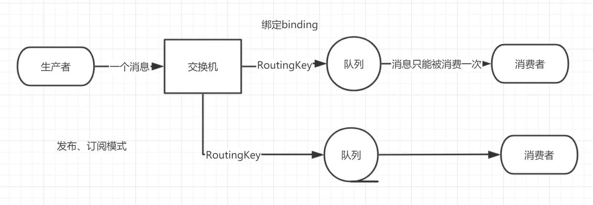

# 七、交换机

## 1、交换机概念

​		RabbitMQ 消息传递模型的核心思想是: **生产者生产的消息从不会直接发送到队列**。实际上，通常生产者甚至都不知道这些消息传递传递到了哪些队列中。

​		相反，**生产者只能将消息发送到交换机(exchange)**，交换机工作的内容非常简单，一方面它接收来自生产者的消息，另一方面将它们推入队列。交换机必须确切知道如何处理收到的消息。是应该把这些消息放到特定队列还是说把他们到许多队列中还是说应该丢弃它们。这就的由交换机的类型来决定。



## 2、交换机类型

- **直接(direct)**：处理路由键。需要将一个队列绑定到交换机上，要求该消息与一个特定的路由键完全匹配。这是一个完整的匹配。如果一个队列绑定到该交换机上要求路由键 abc ，则只有被标记为 abc 的消息才被转发，不会转发 abc.def，也不会转发 dog.ghi，只会转发 abc。

- **主题(topic)**：将路由键和某模式进行匹配。此时队列需要绑定要一个模式上。符号“#”匹配一个或多个词，符号 * 匹配不多不少一个词。因此 abc.# 能够匹配到 abc.def.ghi，但是 abc.* 只会匹配到 abc.def。

- **标题(headers)**：不处理路由键。而是根据发送的消息内容中的headers属性进行匹配。在绑定 Queue 与 Exchange 时指定一组键值对；当消息发送到RabbitMQ 时会取到该消息的 headers 与 Exchange 绑定时指定的键值对进行匹配；如果完全匹配则消息会路由到该队列，否则不会路由到该队列。headers 属性是一个键值对，可以是 Hashtable，键值对的值可以是任何类型。而 fanout，direct，topic 的路由键都需要要字符串形式的。

  匹配规则 x-match 有下列两种类型：

  x-match = all ：表示所有的键值对都匹配才能接受到消息

  x-match = any ：表示只要有键值对匹配就能接受到消息

- **扇出(fanout)**：不处理路由键。你只需要简单的将队列绑定到交换机上。一个发送到交换机的消息都会被转发到与该交换机绑定的所有队列上。很像子网广播，每台子网内的主机都获得了一份复制的消息。Fanout 交换机转发消息是最快的

## 3、临时队列

> 未持久化的队列叫临时队列

```java
String queueName = channel.queueDeclare().getQueue();
```

## 4、绑定


## 5、Fanout模式

> 交换机将接收到的所有消息广播到它绑定的所有队列中

- 之前是生产者和消费者都声明队列，直接通过队列来生产消费消息
- 现在是生产者声明交换机，消费者声明队列，消费者通过rountkey来绑定交换机


### 5.1、生产者

```java
public class EmitLog {
    //声明交换机名称
    private static final String EXCHANGE_NAME = "logs";

    public static void main(String[] args) throws Exception {
        Channel channel = RabbitMqUtils.getChannel();
        /**
         * 声明一个 exchange
         * 1.exchange 的名称
         * 2.exchange 的类型
         */
        channel.exchangeDeclare(EXCHANGE_NAME, BuiltinExchangeType.FANOUT);
        Scanner sc = new Scanner(System.in);
        System.out.println("请输入信息");
        while (sc.hasNext()) {
            String message = sc.nextLine();
            channel.basicPublish(EXCHANGE_NAME, "", null, message.getBytes(StandardCharsets.UTF_8));
            System.out.println("生产者发出消息" + message);
        }
    }
}
```

### 5.2、消费者

**消费者1**

```java
public class ReceiveLogs01 {
    //声明交换机名称
    private static final String EXCHANGE_NAME = "logs";

    public static void main(String[] args) throws Exception {
        Channel channel = RabbitMqUtils.getChannel();
        channel.exchangeDeclare(EXCHANGE_NAME, BuiltinExchangeType.FANOUT);
        /**
         * 生成一个临时的队列 队列的名称是随机的
         * 当消费者断开和该队列的连接时 队列自动删除
         */
        String queueName = channel.queueDeclare().getQueue();
        //绑定临时队列
        channel.queueBind(queueName, EXCHANGE_NAME, "");
        System.out.println("等待接收消息,把接收到的消息打印在屏幕.....");
        channel.basicConsume(
                queueName,
                true,
                (consumerTag, delivery) -> {
                    String message = new String(delivery.getBody(), "UTF-8");
                    System.out.println("消息应答的回调：控制台打印接收到的消息" + message);
                },
                consumerTag -> {
                    System.out.println("消息中断的回调");
                }
        );
    }
}
```

**消费者2**

```java
public class ReceiveLogs02 {
    private static final String EXCHANGE_NAME = "logs";

    public static void main(String[] args) throws Exception {
        Channel channel = RabbitMqUtils.getChannel();
        channel.exchangeDeclare(EXCHANGE_NAME, BuiltinExchangeType.FANOUT);
        /**
         * 生成一个临时的队列 队列的名称是随机的
         * 当消费者断开和该队列的连接时 队列自动删除
         */
        String queueName = channel.queueDeclare().getQueue();
        //绑定临时队列
        channel.queueBind(queueName, EXCHANGE_NAME, "");
        System.out.println("等待接收消息,把接收到的消息写到文件.....");
        channel.basicConsume(
                queueName,
                true,
                (consumerTag, delivery) -> {
                    String message = new String(delivery.getBody(), StandardCharsets.UTF_8);
                    File file = new File("D:\\rabbit_logs\\rabbitmq_info.txt");
                    if (!file.exists()) {
                        FileUtils.writeStringToFile(file, message, "UTF-8");
                    }
                    System.out.println("数据写入文件成功");
                }
                , consumerTag -> {
                    System.out.println("消息中断的回调");
                }
        );
    }
}
```

## 6、Direct模式

> 交换机将消息发布到只有绑定路由的队列中，相当于fanout的变种


### 6.1、生产者

```java
public class EmitLogDirect {
    private static final String EXCHANGE_NAME = "direct_logs";

    public static void main(String[] argv) throws Exception {
        Channel channel = RabbitMqUtils.getChannel();
        channel.exchangeDeclare(EXCHANGE_NAME, BuiltinExchangeType.DIRECT);
        //创建多个 bindingKey
        Map<String, String> bindingKeyMap = new HashMap<>();
        bindingKeyMap.put("info", "普通 info 信息");
        bindingKeyMap.put("warning", "警告 warning 信息");
        bindingKeyMap.put("error", "错误 error 信息");
        //debug 没有消费这接收这个消息 所有就丢失了
        bindingKeyMap.put("debug", "调试 debug 信息");
        for (Map.Entry<String, String> bindingKeyEntry : bindingKeyMap.entrySet()) {
            /*key作为路由*/
            String bindingKey = bindingKeyEntry.getKey();
            /*value作为消息*/
            String message = bindingKeyEntry.getValue();
            /*发布了三个队列*/
            channel.basicPublish(EXCHANGE_NAME, bindingKey, null,
                                 message.getBytes(StandardCharsets.UTF_8));
            System.out.println("生产者发出消息:" + message);
        }
    }
}
```

### 6.2、消费者

**消费者1**

```java
public class ReceiveLogsDirect01 {
    private static final String EXCHANGE_NAME = "direct_logs";

    public static void main(String[] args) throws Exception {
        Channel channel = RabbitMqUtils.getChannel();
        //声明交换机
        channel.exchangeDeclare(EXCHANGE_NAME, BuiltinExchangeType.DIRECT);
        /*连接console的交换机的队列*/
        String queueName = channel.queueDeclare().getQueue();
        channel.queueBind(queueName, EXCHANGE_NAME, "info");
        channel.queueBind(queueName, EXCHANGE_NAME, "warning");
        System.out.println("等待接收消息.....");
        /*消费消息*/
        channel.basicConsume(
                queueName,
                true,
                (consumerTag, delivery) -> {
                    String message = new String(delivery.getBody(), StandardCharsets.UTF_8);
                    System.out.println("绑定的路由键是:" + delivery.getEnvelope().getRoutingKey() + ",消息:" + message);
                },
                consumerTag -> {
                }
        );
    }
}
```

**消费者2**

```java
public class ReceiveLogsDirect02 {
    private static final String EXCHANGE_NAME = "direct_logs";

    public static void main(String[] argv) throws Exception {
        Channel channel = RabbitMqUtils.getChannel();
        channel.exchangeDeclare(EXCHANGE_NAME, BuiltinExchangeType.DIRECT);
        String queueName = channel.queueDeclare().getQueue();
        channel.queueBind(queueName, EXCHANGE_NAME, "error");
        System.out.println("等待接收消息.....");
        channel.basicConsume(
                queueName,
                true,
                (consumerTag, delivery) -> {
                    String message = new String(delivery.getBody(), StandardCharsets.UTF_8);
                    message = "绑定的路由键是:" + delivery.getEnvelope().getRoutingKey() + ",消息:" + message;
                    File file = new File("D:\\rabbit_logs\\rabbitmq_info.txt");
                    FileUtils.writeStringToFile(file, message, "UTF-8");
                    System.out.println("错误日志已经接收");
                },
                consumerTag -> {
                }
        );
    }
}
```

## 7、Topics模式

> 主题模式：必须是一个单词列表，以点号分隔开；*号代替一个单词，#号代替零个或多个单词

**主题交换机：包含了广播和路由交换机的所有优点**

- **当一个队列绑定键是#,那么这个队列将接收所有数据，就有点像fanout了**
- **如果队列绑定键当中没有#和*出现，那么该队列绑定类型就是direct了**


| 案例                     | 接收                                       |
| ------------------------ | ------------------------------------------ |
| quick.orange.rabbit      | 被队列 Q1Q2 接收到                         |
| lazy.orange.elephant     | 被队列 Q1Q2 接收到                         |
| quick.orange.fox         | 被队列 Q1 接收到                           |
| lazy.brown.fox           | 被队列 Q2 接收到                           |
| lazy.pink.rabbit         | 虽然满足两个绑定但只被队列 Q2 接收一次     |
| quick.brown.fox          | 不匹配任何绑定不会被任何队列接收到会被丢弃 |
| quick.orange.male.rabbit | 是四个单词不匹配任何绑定会被丢弃           |
| lazy.orange.male.rabbit  | 是四个单词但匹配 Q2                        |

### 7.1、生产者

```java
public class EmitLogTopic {
    private static final String EXCHANGE_NAME = "topic_logs";

    public static void main(String[] argv) throws Exception {
        Channel channel = RabbitMqUtils.getChannel();
        /*声明交换机*/
        channel.exchangeDeclare(EXCHANGE_NAME, "topic");
        /**
         * Q1-->绑定的是
         * 中间带 orange 带 3 个单词的字符串(*.orange.*)
         * Q2-->绑定的是
         * 最后一个单词是 rabbit 的 3 个单词(*.*.rabbit)
         * 第一个单词是 lazy 的多个单词(lazy.#)
         *
         */
        Map<String, String> bindingKeyMap = new HashMap<>();
        /*生产者将要发布的消息*/
        bindingKeyMap.put("quick.orange.rabbit", "被队列 Q1Q2 接收到");
        bindingKeyMap.put("lazy.orange.elephant", "被队列 Q1Q2 接收到");
        bindingKeyMap.put("quick.orange.fox", "被队列 Q1 接收到");
        bindingKeyMap.put("lazy.brown.fox", "被队列 Q2 接收到");
        bindingKeyMap.put("lazy.pink.rabbit", "虽然满足两个绑定但只被队列 Q2 接收一次");
        bindingKeyMap.put("quick.brown.fox", "不匹配任何绑定不会被任何队列接收到会被丢弃");
        bindingKeyMap.put("quick.orange.male.rabbit", "是四个单词不匹配任何绑定会被丢弃");
        bindingKeyMap.put("lazy.orange.male.rabbit", "是四个单词但匹配 Q2");
        for (Map.Entry<String, String> bindingKeyEntry : bindingKeyMap.entrySet()) {
            String bindingKey = bindingKeyEntry.getKey();
            String message = bindingKeyEntry.getValue();
            channel.basicPublish(EXCHANGE_NAME, bindingKey, null,
                    message.getBytes(StandardCharsets.UTF_8));
            System.out.println("生产者发出消息" + message);
        }
    }
}
```

### 7.2、消费者

**消费者1**

```java
public class ReceiveLogsTopic01 {
    private static final String EXCHANGE_NAME = "topic_logs";

    public static void main(String[] argv) throws Exception {
        Channel channel = RabbitMqUtils.getChannel();
        channel.exchangeDeclare(EXCHANGE_NAME, "topic");
        /*声明临时队列*/
        String queueName = channel.queueDeclare().getQueue();
        channel.queueBind(queueName, EXCHANGE_NAME, "*.orange.*");
        System.out.println("等待接收消息.....");
        channel.basicConsume(
                queueName,
                true,
                (consumerTag, delivery) -> {
                    String message = new String(delivery.getBody(), StandardCharsets.UTF_8);
                    System.out.println("接收队列:" + queueName + "绑定键:" + delivery.getEnvelope().getRoutingKey() + ",消息:" + message);
                },
                consumerTag -> {
                }
        );
    }
}
```

**消费者2**

```java
public class ReceiveLogsTopic02 {
    private static final String EXCHANGE_NAME = "topic_logs";

    public static void main(String[] argv) throws Exception {
        Channel channel = RabbitMqUtils.getChannel();
        channel.exchangeDeclare(EXCHANGE_NAME, "topic");
        /*声明临时队列*/
        String queueName = channel.queueDeclare().getQueue();
        channel.queueBind(queueName, EXCHANGE_NAME, "*.*.rabbit");
        channel.queueBind(queueName, EXCHANGE_NAME, "lazy.#");
        System.out.println("等待接收消息.....");
        channel.basicConsume(
                queueName,
                true,
                (consumerTag, delivery) -> {
                    String message = new String(delivery.getBody(), StandardCharsets.UTF_8);
                    System.out.println("接收队列:" + queueName + "绑定键:" + delivery.getEnvelope().getRoutingKey() + ",消息:" + message);
                },
                consumerTag -> {
                }
        );
    }
}
```

# 